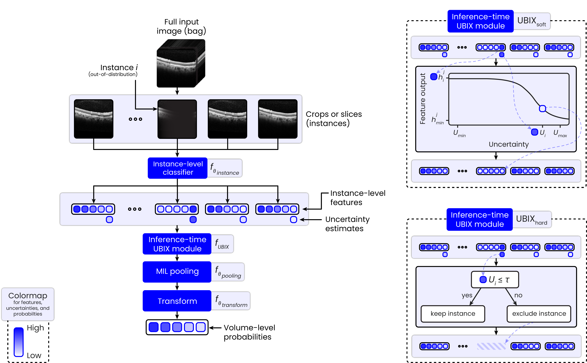
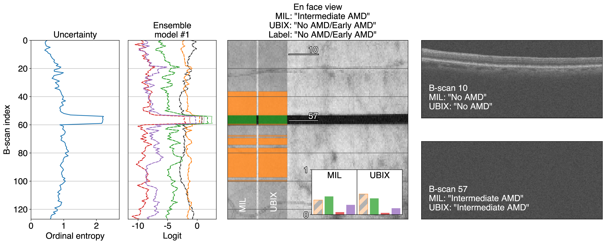
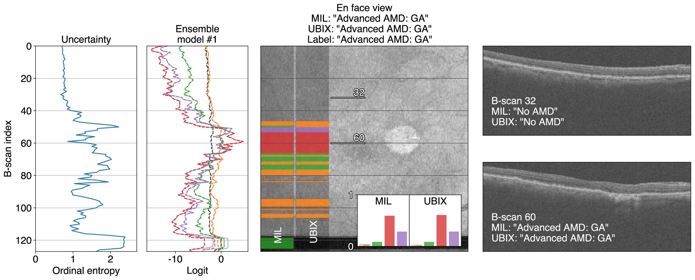

# Uncertainty-Based Instance eXclusion (UBIX) for Reliable Classification
This repository provides the code for **Uncertainty-Based Instance eXclusion (UBIX)**, the method described in _Uncertainty-aware multiple-instance learning for reliable classification: Application to optical coherence tomography_ (de Vente _et al._, 2023). ([ArXiv](https://arxiv.org/abs/2302.03116))

UBIX is a method to improve the generalizability of classification models, by introducing built-in robustness to dataset-specific (out-of-distribution) artifacts, without requiring any additional training (supervised or unsupervised) on data with such artifacts. UBIX is an inference-time module that can be employed in multiple-instance learning (MIL) settings. Instead of assuming equal contribution of all instances to the bag-level output, UBIX detects instances corrupted due to local artifacts on-the-fly using uncertainty estimation, reducing (UBIX<sub>soft</sub>) or fully ignoring (UBIX<sub>hard</sub>) their contributions before MIL pooling.


<p align="center"><i>
  Overview of the general MIL pipeline (left) and how the two UBIX variants are integrated into this pipeline (right).
</i></p>


<p align="center"><i>
  UBIX correctly predicts "No AMD/Early AMD", while MIL incorrectly predicts "Intermediate AMD'. UBIX suppresses the instance-level outputs at the location of the artifact around B-scan 57, causing it to be robust to that artifact, in contrast to MIL.
</i></p>


<p align="center"><i>
  Correct GA volume-level classification. Central GA is also well visible in the en face image as a white circular object around B-scan 60, which is pointed out by the instance-level output in red.
</i></p>

## Installation
To install UBIX, run this command from the root folder:
```
pip3 install -e .
```

This will install the required packages, including the `ubix` package.

## Usage

### Data preparation
For training and inference, data needs to prepared in the right format. Here, we present an example of how to get the Farsiu OCT dataset into the right format (referred to as B<sub>test</sub> in the paper), but you can adapt the relevant scripts to use this code base for your own datasets.

1. Download the Farsiu/Duke dataset from [here](https://people.duke.edu/~sf59/RPEDC_Ophth_2013_dataset.htm).

2. Extract the .zip files and make sure your folder structure looks like this:
    ```
    - /path/to/original_farsiu_folder/
      - AMD
        - Farsiu_Ophthalmology_2013_AMD_Subject_1001.mat
        - Farsiu_Ophthalmology_2013_AMD_Subject_1002.mat
        ...
        - Farsiu_Ophthalmology_2013_AMD_Subject_1269.mat
      - Control
        - Farsiu_Ophthalmology_2013_Control_Subject_1001.mat
        - Farsiu_Ophthalmology_2013_Control_Subject_1002.mat
        ...
        - Farsiu_Ophthalmology_2013_Control_Subject_1115.mat
    ```

3. Run the following script (remember to fill in the correct path arguments):
    ```
    python3 prepare_farsiu.py --input_folder=/path/to/original_farsiu_folder/ \
    --nifti_folder=/path/to/nifti/raw \
    --resampled_folder=/path/to/nifti/resampled
    ```

Now, `/path/to/nifti/resampled` is ready for use and should have the following structure:

```
- /path/to/nifti/resampled
  - train
    - labels.json  # this file has to be present, but can be empty if the train set is empty
  - val
    - labels.json  # this file has to be present, but can be empty if the val set is empty
  - test
    - <image_1>.nii.gz
    - <image_2>.nii.gz
    - <image_N>.nii.gz
    - labels.json
```

Your `labels.json` file should look like this:

```
{
    "<image_1>": 0,  # NOTE: The key values ONLY contain the image name, not the file extension ".nii.gz".
    "<image_2>": 2,  # Classification labels are denoted as values using integers.
    ...
    "<image_N>": 4,
}
```

Note that you can in principle bring any dataset in this structure of `.nii.gz` and `labels.json` files, allowing you to use any dataset with this code base. While doing this, make sure the spacing is correctly set in your `.nii.gz` files. If you would like to train your own models, you fill a `train` and `val` folder as well, in the same way with image and label files.

### Using our pre-trained models
You can run our pre-trained models that are described in the paper, including the UBIX parameters that we optimized on our validation set. You do not need to manually download the model weights, they will automatically be extracted from the URLs in `ubix/public_models_urls.json`.

We refer you to [this notebook](<./Applying UBIX to trained models.ipynb>) with a guide on how to use UBIX on already trained models.

### Training your own models
New models can be defined in the `ubix/experiments` folder using `.yaml` files. To, for example, train a new MIL model with Max pooling, you can use the file: `ubix/experiments/new/maxpooling.yaml`. Adapt the `data_root` value from `/path/to/your/data_root` to your actual data root folder and you should be good to go. This folder should contain a `train`, `val`, and `test` folder, and follow the structure described as described [here](#data-preparation).

To train one of our models, you just run:

```
python3 ubix/train.py --experiment=new-maxpooling/0
```

The `--experiment` argument describes the experiment name and the path to the `.yaml` file relative to the `experiments` folder. Dashes (`-`) are folder separators and the number after the `/` indicates the model number in the ensemble.

To train the next models in the ensemble, train `--experiment=<model-name>/1`, `--experiment=<model-name>/2`, etc. And yes, the code always assumes you are training an ensemble. If you prefer to only train a single model, just only train `--experiment=<model-name>/0`.

## Reference
When using this code, please cite the UBIX paper:

```
@article{de2023uncertainty,
  title={Uncertainty-aware multiple-instance learning for reliable classification: Application to optical coherence tomography},
  author={de Vente, Coen and van Ginneken, Bram and Hoyng, Carel B and Klaver, Caroline CW and S{\'a}nchez, Clara I},
  journal={arXiv preprint arXiv:2302.03116},
  year={2023}
}
```